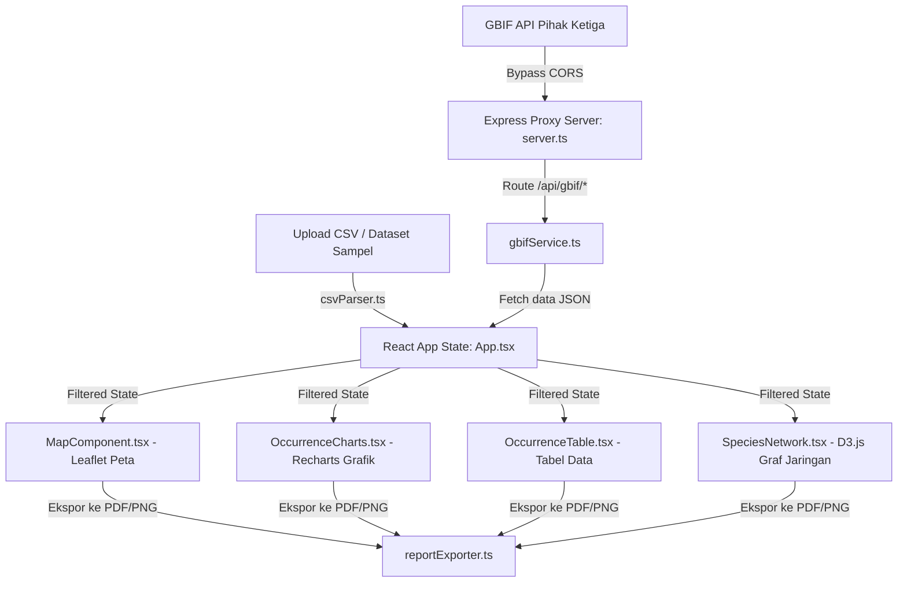

# Agent Guidelines & Codebase Context (GBIF Biodiversity Trend Analyzer)

Dokumen ini berisi panduan teknis, arsitektur data, dan aturan pengembangan bagi AI Coding Assistant (seperti Antigravity) yang bekerja pada repositori ini. Silakan baca berkas ini sebelum melakukan modifikasi apa pun untuk menghemat pemrosesan token dan menjaga konsistensi codebase.

---

## ⚠️ ATURAN EMAS UTAMA (CRITICAL RULE)
1. **Dilarang Menghapus Kode**: Anda tidak boleh menghapus kode/fitur yang sudah ada saat ini. Anda hanya diperbolehkan menambahkan kode baru, memperluas fitur, atau memperbaiki bug pada bagian tertentu tanpa merusak atau mereduksi logika fungsionalitas yang ada.
2. **Keindahan Visual (Aesthetics)**: Aplikasi menggunakan TailwindCSS v4 dengan palet warna modern, transisi halus, micro-animations, dan tata letak profesional. Semua penambahan UI baru wajib mengikuti tingkat kerapihan estetika ini.
3. **Konvensi Link Berkas**: Bila merujuk file dalam percakapan atau dokumen rencana kerja, selalu buat tautan absolut yang dapat diklik menggunakan format `file:///c:/web/gbif-biodiversity-trend-analyzer/<path_ke_file>`.

---

## Arsitektur & Alur Data

Secara garis besar, aplikasi ini mengambil data kejadian biodiversitas (*species occurrence*), memprosesnya secara client-side, dan menyajikannya dalam 4 visualisasi interaktif utama.



---

## Detail Modul & File Penting

### 1. Backend & Proxy
- **[server.ts](file:///c:/web/gbif-biodiversity-trend-analyzer/server.ts)**:
  - Menyediakan server Express pada port `3000`.
  - Mengimplementasikan route `/api/gbif/*` yang meneruskan request ke `https://api.gbif.org/v1/*`. Ini sangat penting untuk menghindari *CORS error* di browser, pemblokiran adblocker, dan restriksi *iframe sandboxing*.
  - Melayani aset statis produksi dari direktori `/dist` dan mengintegrasikan middleware Vite dalam mode pengembangan (`development`).

### 2. Layanan Data (Utils)
- **[types.ts](file:///c:/web/gbif-biodiversity-trend-analyzer/src/types.ts)**:
  - Berisi struktur data TypeScript utama seperti `GBIFOccurrence`, `GBIFFilters`, dan mapping lokalisasi bahasa Indonesia untuk basis pencatatan (`BASIS_OF_RECORD_LABELS`) serta daftar kode negara (`COUNTRY_CODES`).
- **[gbifService.ts](file:///c:/web/gbif-biodiversity-trend-analyzer/src/utils/gbifService.ts)**:
  - Berisi fungsi `searchOccurrences` untuk mencari data kejadian dengan filter dinamis dan `suggestScientificNames` untuk autocomplete input nama ilmiah taksonomi.
  - **Catatan**: Selalu gunakan endpoint `/api/gbif/...` dan hindari panggilan langsung ke server `api.gbif.org` dari sisi klien.
- **[csvParser.ts](file:///c:/web/gbif-biodiversity-trend-analyzer/src/utils/csvParser.ts)**:
  - Mengandung fungsi parser CSV kustom `parseCSV` yang aman terhadap karakter khusus, koma dalam tanda kutip, dan variasi baris baru (`\r\n` atau `\n`).
  - Fungsi `mapCSVToOccurrences` memetakan kolom CSV ke interface `GBIFOccurrence` secara cerdas dengan menganalisis kecocokan nama kolom (sinonim) secara case-insensitive.
- **[sampleDatasets.ts](file:///c:/web/gbif-biodiversity-trend-analyzer/src/utils/sampleDatasets.ts)**:
  - Menyimpan data sampel awal (default saat load: *Harimau Sumatra*) untuk menampilkan dasbor yang cantik saat aplikasi dibuka pertama kali.

### 3. Komponen Visualisasi & UI
- **[App.tsx](file:///c:/web/gbif-biodiversity-trend-analyzer/src/App.tsx)**:
  - Mengelola *parent state* untuk pencarian, data occurrences, dataset aktif, tab aktif, penanganan error, dan status loading.
  - Memiliki mesin pemfilteran client-side (*Client-side Filter Engine*) berbasis `useMemo` yang memproses filter taksonomi, temporal, koordinat, negara, dan basis pencatatan secara responsif.
- **[FilterSidebar.tsx](file:///c:/web/gbif-biodiversity-trend-analyzer/src/components/FilterSidebar.tsx)**:
  - Panel samping kiri untuk pencarian nama ilmiah (dilengkapi fitur autocomplete takson), filter hierarki takson (Filum, Kelas, Ordo, Famili, Genus), tahun awal/akhir, basis pencatatan, dan negara asal data.
  - Mendukung preset dataset cepat dan tombol unggah berkas CSV kustom.
- **[MapComponent.tsx](file:///c:/web/gbif-biodiversity-trend-analyzer/src/components/MapComponent.tsx)**:
  - Menampilkan peta berbasis **Leaflet** menggunakan style ubin (tiles) *CartoDB Voyager* yang bersih.
  - Menampilkan marker pin dengan animasi pulse SVG. Warna marker disesuaikan secara dinamis dengan Basis Pencatatan data.
- **[OccurrenceCharts.tsx](file:///c:/web/gbif-biodiversity-trend-analyzer/src/components/OccurrenceCharts.tsx)**:
  - Merender visualisasi data menggunakan **Recharts**: grafik tren temporal, keragaman taksonomi (Top 8 genus/famili/kelas), pola musiman bulanan, proporsi basis pencatatan, dan distribusi negara.
- **[OccurrenceTable.tsx](file:///c:/web/gbif-biodiversity-trend-analyzer/src/components/OccurrenceTable.tsx)**:
  - Tabel grid interaktif untuk melihat baris data occurrences lengkap dengan fitur pencarian teks bebas, pengurutan kolom, dan pagination.
- **[SpeciesNetwork.tsx](file:///c:/web/gbif-biodiversity-trend-analyzer/src/components/SpeciesNetwork.tsx)**:
  - Menggunakan **D3.js Force Simulation** untuk menggambar hubungan spasial dan taksonomi antarspesies.
  - Menghitung keterkaitan spesies berdasarkan habitat tumpang tindih (*sympatry*) di grid spasial serta kedekatan tingkat taksonomi.

### 4. Sistem Ekspor Laporan
- **[reportExporter.ts](file:///c:/web/gbif-biodiversity-trend-analyzer/src/utils/reportExporter.ts)**:
  - Mengonversi elemen DOM dasbor menjadi berkas PDF multi-halaman (`jsPDF`) atau gambar PNG (`html2canvas`).
  - **Penting**: Mengandung polyfill kustom `resolveOklchColors` dan `applyOklchInlinePolyfill` untuk mengubah warna format `oklch(...)` TailwindCSS v4 menjadi warna hex/rgba yang kompatibel dengan elemen `<canvas>` sebelum proses tangkapan layar dilakukan. Jangan hapus fungsi ini karena akan merusak warna hasil ekspor laporan.

---

## Panduan Coding & Pengembangan

1. **Gunakan Tailwind v4 secara Konsisten**:
   - Tailwind v4 diaktifkan di `@tailwindcss/vite` dan dikonfigurasi melalui `@theme` pada `index.css`.
   - Hindari menulis inline styles kustom untuk warna jika kelas utilitas Tailwind sudah menyediakannya.

2. **Gaya Penulisan Kode (TypeScript)**:
   - Pastikan type safety tetap terjaga dengan memperbarui interface di `types.ts` apabila ada perubahan parameter filter atau data kejadian.
   - Gunakan React hook seperti `useMemo` dan `useCallback` untuk fungsi pemrosesan data bervolume besar guna menjaga FPS dasbor di atas 60.

3. **Dokumentasi & Lisensi**:
   - Semua berkas kode baru atau modifikasi wajib menyertakan lisensi header Apache-2.0 standar:
     ```typescript
     /**
      * @license
      * SPDX-License-Identifier: Apache-2.0
      */
     ```
