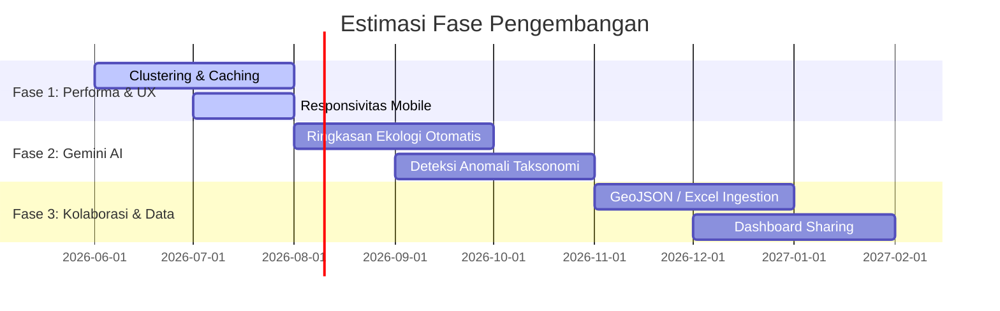

# Roadmap Pengembangan - GBIF Biodiversity Trend Analyzer

Dokumen ini merinci peta jalan (*roadmap*) pengembangan fitur, peningkatan performa, dan pemeliharaan teknis untuk aplikasi **GBIF Biodiversity Trend Analyzer**. Peta jalan ini dibagi menjadi tiga fase utama ditambah dengan rencana penanganan *Technical Debt*.

---

## 🗺️ Gambaran Umum Fase Pengembangan

---

## 🛠️ Detail Rencana Aksi

### Fase 1: Performa Tinggi & Pengalaman Pengguna (UX)
*Fokus pada optimalisasi visualisasi client-side ketika menangani volume data kejadian yang sangat besar (> 5,000 titik).*

1. **Implementasi Leaflet Marker Clustering**
   - Mengintegrasikan pustaka `leaflet.markercluster` untuk mengelompokkan penanda geografis yang berdekatan. Ini akan sangat meningkatkan responsivitas peta saat memuat ribuan data kejadian.
2. **Caching Query & Autocomplete**
   - Menambahkan mekanisme *Local Storage* atau *In-Memory Cache* pada [gbifService.ts](file:///c:/web/gbif-biodiversity-trend-analyzer/src/utils/gbifService.ts) untuk query pencarian taksonomi dan hasil filter. Hal ini mengurangi latensi pemuatan saat pengguna menelusuri data yang sama berulang kali.
3. **Penyempurnaan Tampilan Responsif (Mobile Friendly)**
   - Mendesain ulang tata letak dasbor agar layout tab (`spasial`, `statistik`, `tabel`, `jaringan`) bekerja maksimal di perangkat ponsel pintar dan tablet.
4. **Optimasi Graf Jaringan D3.js**
   - Menambahkan pembatasan (pagination/threshold) pada jumlah spesies maksimum yang ditampilkan di [SpeciesNetwork.tsx](file:///c:/web/gbif-biodiversity-trend-analyzer/src/components/SpeciesNetwork.tsx) (misal batas 150 node terkuat) untuk mencegah penurunan FPS browser saat menggunakan dataset berskala besar.

---

### Fase 2: Integrasi Gemini AI & Analisis Pintar
*Memanfaatkan kapabilitas kecerdasan buatan untuk membantu peneliti/biolog menarik kesimpulan ilmiah secara instan.*

1. **Generator Ringkasan Ekologi Otomatis**
   - Menambahkan fitur "Generasikan Analisis AI" menggunakan SDK `@google/genai` (koneksi server-side).
   - Gemini AI akan membaca agregasi data statistik, tren musiman, dan sebaran spasial yang terpilih saat itu untuk menyusun laporan deskriptif naratif mengenai status konservasi, ancaman musiman, dan habitat utama spesies.
2. **Deteksi Anomali Sebaran & Taksonomi**
   - Menggunakan model bahasa besar (Gemini) untuk mengidentifikasi kemungkinan kesalahan input data (misalnya: koordinat spesies darat yang jatuh di tengah lautan luas, atau penemuan spesies tropis di kutub utara).
3. **Pemberian Rekomendasi Takson Terkait**
   - AI menyarankan analisis tambahan untuk spesies kompetitor, predator, atau mangsa yang memiliki pola spasial/simpatrik serupa berdasarkan visualisasi graf jaringan D3.

---

### Fase 3: Perluasan Ingest Data & Kolaborasi
*Membuka akses pemrosesan dokumen lokal dan kemampuan berbagi temuan.*

1. **Ingest Format Tambahan (Excel, GeoJSON, KML, GPX)**
   - Memperluas [csvParser.ts](file:///c:/web/gbif-biodiversity-trend-analyzer/src/utils/csvParser.ts) agar mampu mengurai berkas lembar kerja Microsoft Excel (`.xlsx`) secara client-side menggunakan parser ringan.
   - Mendukung impor batas wilayah (.GeoJSON) untuk memfilter titik koordinat sebaran yang hanya masuk dalam batas poligon tertentu.
2. **Ekspor Data Mentah Tingkat Lanjut**
   - Memungkinkan pengunduhan subset data terfilter langsung ke format GeoJSON dan CSV bersih untuk dianalisis kembali menggunakan software GIS profesional seperti QGIS atau ArcGIS.
3. **Berbagi Dasbor (Public Dashboard Sharing)**
   - Menyediakan fitur *Share Link* yang mengodekan seluruh parameter filter aktif ke dalam URL hash, sehingga kolaborator lain dapat membuka dasbor dengan kondisi filter yang persis sama.

---

## 🧹 Rencana Pengurangan Hutang Teknis (Technical Debt)

Untuk menjaga keberlanjutan kode dan kemudahan kolaborasi jangka panjang:

1. **Peningkatan Unit Testing (Cakupan Uji > 80%)**
   - Menambahkan kerangka pengujian (seperti Vitest) untuk menguji utilitas parser [csvParser.ts](file:///c:/web/gbif-biodiversity-trend-analyzer/src/utils/csvParser.ts) dengan berbagai format data rusak, serta logika perhitungan bobot simpatrik di [SpeciesNetwork.tsx](file:///c:/web/gbif-biodiversity-trend-analyzer/src/components/SpeciesNetwork.tsx).
2. **Modularisasi Komponen App.tsx**
   - Memecah *parent component* [App.tsx](file:///c:/web/gbif-biodiversity-trend-analyzer/src/App.tsx) yang saat ini berukuran > 600 baris menjadi beberapa sub-komponen fungsional terpisah (seperti pemisah komponen Tab Navigation, Loader Overlay, dan Header).
3. **Pembersihan Logika Penyelarasan Warna OKLCH**
   - Menstabilkan modul penanganan warna [reportExporter.ts](file:///c:/web/gbif-biodiversity-trend-analyzer/src/utils/reportExporter.ts) agar tidak bergantung pada canvas buatan temporer, melainkan membaca token CSS variabel dari Tailwind v4 yang dikonversi ke format RGB saat ekspor dilakukan.
